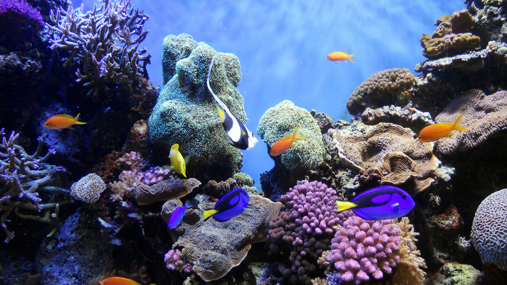
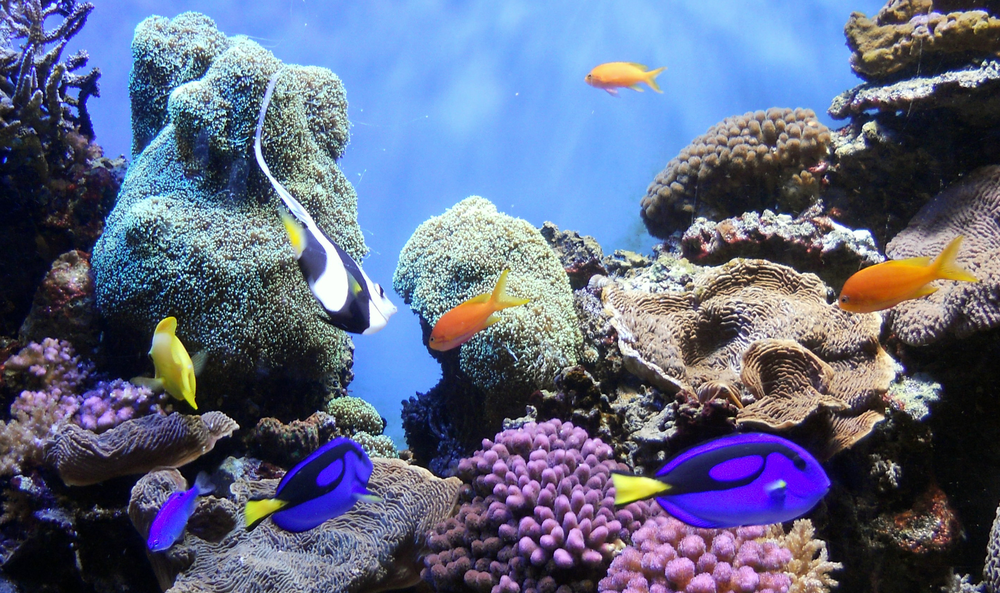

<!DOCTYPE html>
<html lang="en">
  <head>
    <meta charset="UTF-8" />
   <!-- <title>Web Images</title>-->
  </head>

  <body>

   <h1>Web Images</h1>
   

    File size:1.85 

    

    
Low quality (0%). File size:253KB 

    
 
    
Medium quality (30%). File size:526KB 

    
High quality (60%). File size:1.03MB 

    

    
Very quality (80%). File size:1.72MB 

    

    
Maximum quality (100%). File size:3.53MB 

    
  </body>
</html>
